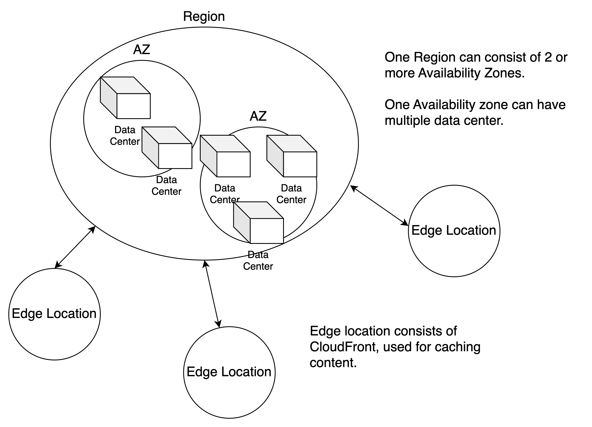

# Availability Zone and Region

# Share Responsibility
**Customer**
Responsibility for security **In** the cloud.
Can you do this in your AWS console? If yes, then it is likely to be your responsibility.
**AWS**
Responsibility for security **Of** the cloud.

# Compute, Storage, Database, Networking
Compute: EC2, Lambda, Elastic Beanstalk \
Storage: S3, EBS, EFS, FSx, Storage Gateway \
Database: RDS, DynamoDB, Redshit \
Networking: VPCs, Direct Connect, Route 53, API Gateway, AWS Global Accelerator \