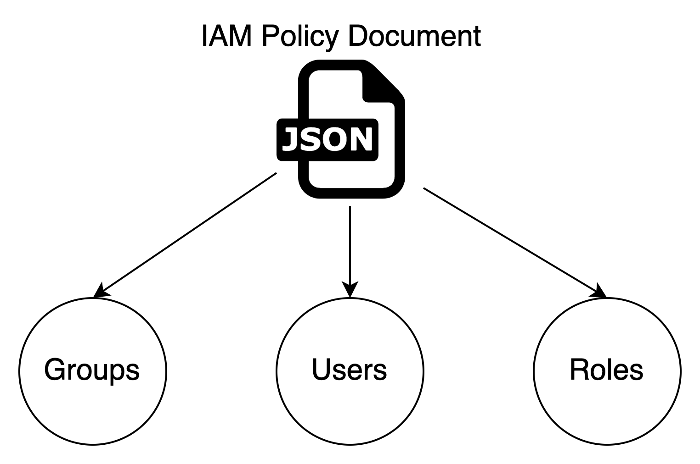

# Secure the root account
IAM allows us to:

1. Create users and grant permissions to those users.
2. Create groups and roles.
3. Control access to AWS resources.

# IAM Policy documents
Policy document looks like below:
```json
{
  "Version": "2012-10-17",
  "Statement": [
    {
      "Effect": "Allow",
      "Action": "*",
      "Resource": "*"
    }
  ]
}
```
And Policy can be assigned to Groups, Users, Roles. \
But better only assign to groups and roles for easily administrating the access.
